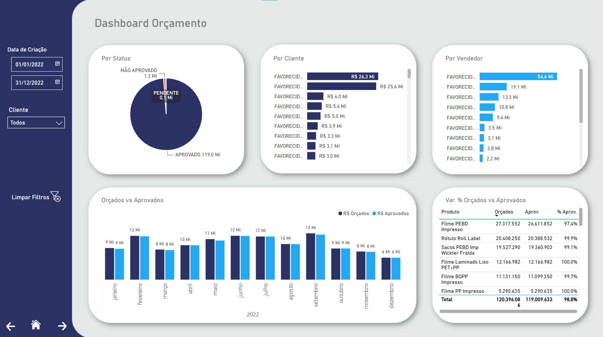
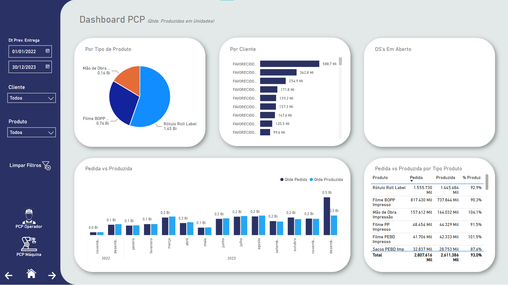
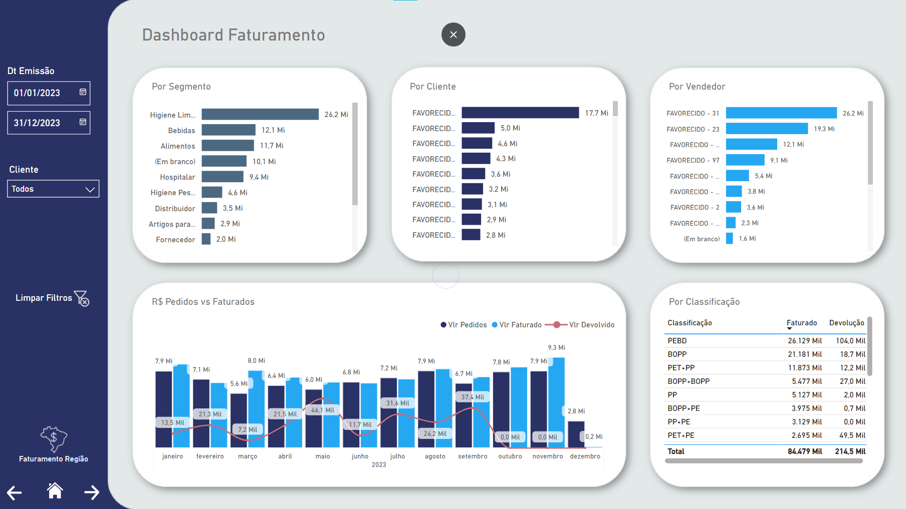
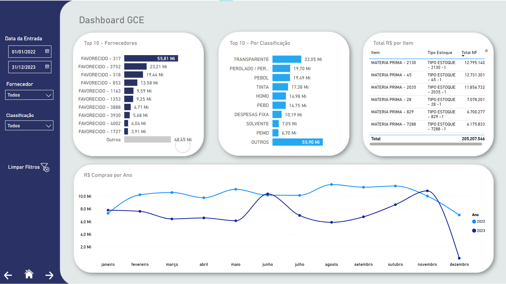
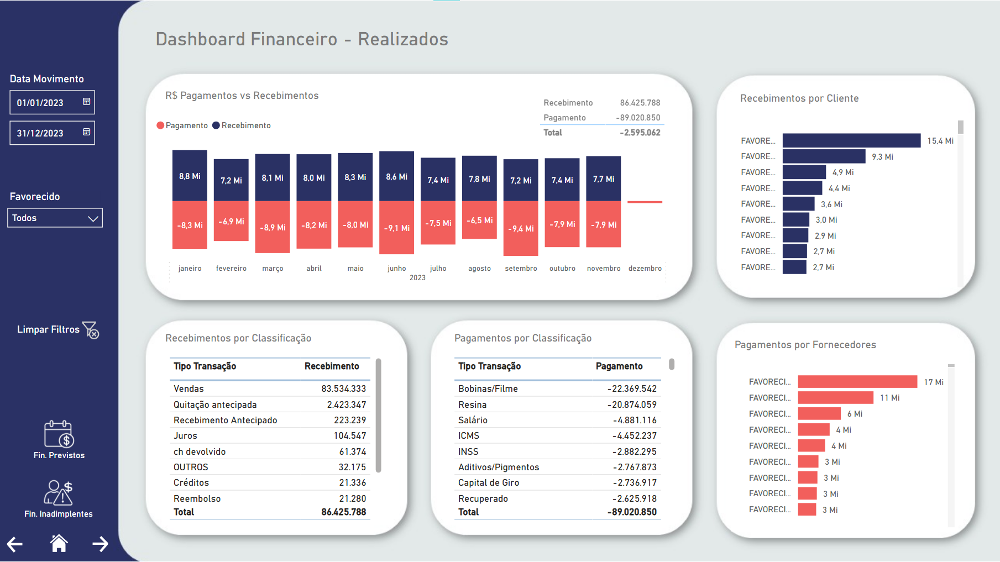

# 📊 ERP Analytics Dashboard

> Dashboard empresarial desenvolvido durante estágio, com foco em Business Intelligence para os principais módulos de um sistema ERP. Construído com **Power BI** conectado a um **Data Warehouse** via **ODBC**.

---

## 🧩 Módulos

### 💰 Orçamento
Acompanhamento de orçamentos gerados, aprovados e pendentes — com comparativo mensal e taxa de aprovação por produto.

---

### 🏭 PCP — Planejamento e Controle da Produção
Visão de quantidade pedida vs produzida por tipo de produto, cliente e período. Inclui OS's em aberto e % de produção atingida.

---

### 🧾 Faturamento
Receitas por segmento, cliente e vendedor. Comparativo mensal entre pedidos e faturados, com volume de devoluções e breakdown por classificação de produto.

---

### 📦 GCE — Gestão e Controle de Estoque
Top fornecedores e classificações de matéria-prima, total por item e evolução anual de compras com comparativo entre anos.

---

### 🏦 Financeiro
Fluxo de pagamentos vs recebimentos mensais, detalhamento por tipo de transação, principais clientes e fornecedores.

---

## 🛠️ Tecnologias e Ferramentas

- **Power BI Desktop** — modelagem, DAX e visualizações
- **Data Warehouse (DW)** — fonte centralizada de dados
- **ODBC** — conexão entre o DW e o Power BI
- **DAX** — medidas e KPIs calculados

---

## 🚀 Como Visualizar

1. Faça o download do arquivo [`dashboard/dashboard_erp.pbix`](dashboard/dashboard_erp.pbix)
2. Abra com o **Power BI Desktop** (gratuito — [baixar aqui](https://powerbi.microsoft.com/pt-br/desktop/))
3. Os dados de demonstração já estão embutidos no arquivo

> ⚠️ Os dados utilizados neste projeto são **fictícios ou anonimizados**, não contendo informações reais ou sensíveis da empresa.

---

## 💡 Aprendizados

- Modelagem dimensional de dados em ambiente de DW real
- Integração de múltiplas fontes via ODBC
- Criação de medidas DAX para KPIs de negócio
- Design de dashboards orientados à tomada de decisão gerencial

---

